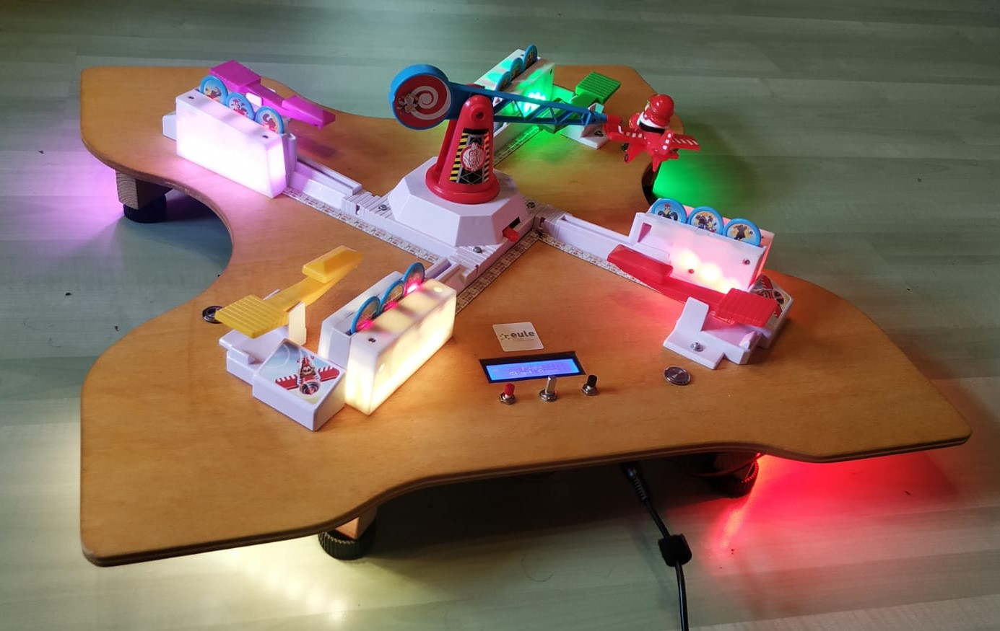

# LoopingLouie

Getuntes Looping Louie mit Geschwindigkeits- und Richtungsmanipulation, Leuchteffekten und automatischer Münzzählung durch Laserschranken. Ursprünglich 2015 in der EULE in Schwäbisch Gmünd erstellt, Anfang 2020 in Zusammenarbeit mit Thomas Ströbele um Leuchteffekte und Laserschranken erweitert.
